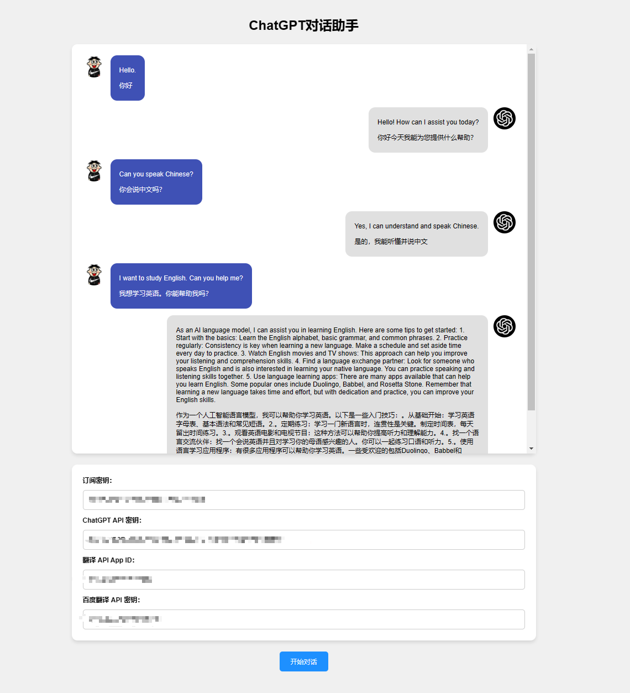

# ChatGPT 对话助手

ChatGPT 对话助手是一个基于 OpenAI GPT-4 的聊天助手应用，它能够使用语音输入与语音输出与用户进行交互。此外，它还具有文本翻译功能，支持英语与中文之间的实时互译。



## 功能

- 语音识别 (Speech-to-Text)：将用户的语音输入转换为文本
- 文本生成 (Text Generation)：使用 OpenAI GPT-4 生成回复
- 语音合成 (Text-to-Speech)：将生成的文本转换为语音输出
- 文本翻译：实时英中互译，支持百度翻译 API

## 系统要求
目前，由于个人能力有限，ChatGPT 对话助手仅支持本地Windows访问,欢迎大家多提交代码优化，让这个项目变得更好，以便更多人可以使用。

## 安装与运行

1. 克隆此仓库
```git
git clone https://github.com/wangwangit/chatgpt-english.git
```
2. 进入项目目录
```bash
cd chatgpt-web
```
3. 安装依赖项
```bash
npm install 指定依赖
```
4. 运行项目
直接点击index.html文件即可运行

## 配置

在 `index.html` 文件中，确保已经包含以下 JavaScript 库：

- Microsoft Cognitive Services Speech SDK（SpeechSDK）
- CryptoJS
- jQuery

在 `app.js` 文件中，将以下变量替换为你的 API 密钥和其他凭据：

- `speech-api-key`：Microsoft Cognitive Services Speech SDK 订阅密钥
- `chatgpt-api-key`：OpenAI ChatGPT API 密钥
- `translate-app-id`：百度翻译 App ID
- `translate-api-key`：百度翻译 API 密钥


## 注意事项

- 请注意 API 请求限制，因为一些 API 服务可能会限制请求的频率或数量。确认你的请求没有超出这些限制。
- 如果你想在服务器上部署此项目，需要使用 Express.js 等 Web 框架创建一个简单的 Web 服务器，并确保服务器具有处理 HTTP 请求的功能。同时，要确保客户端与服务器进行通信，以便正确处理 API 请求和响应。

## 开源许可

此项目采用 [MIT License](LICENSE) 许可。

## 贡献

欢迎提交 issue 和 pull request 以帮助改进此项目。请遵循贡献指南来确保你的贡献得到适当的处理。

如果你觉得这个项目对你有帮助，请给它一个星星，以便让更多人了解它。谢谢！